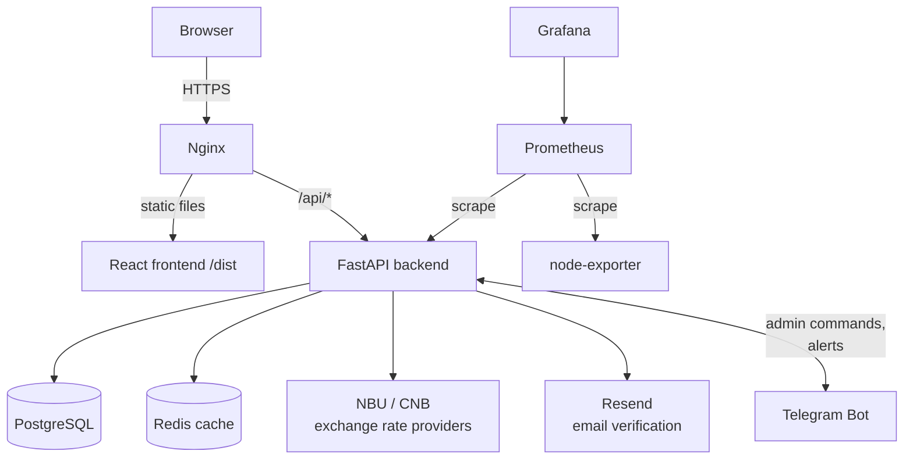
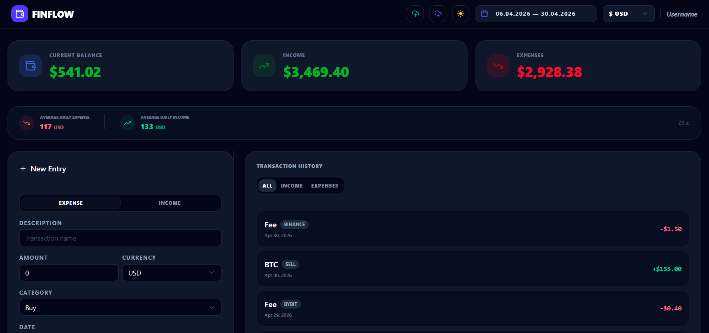
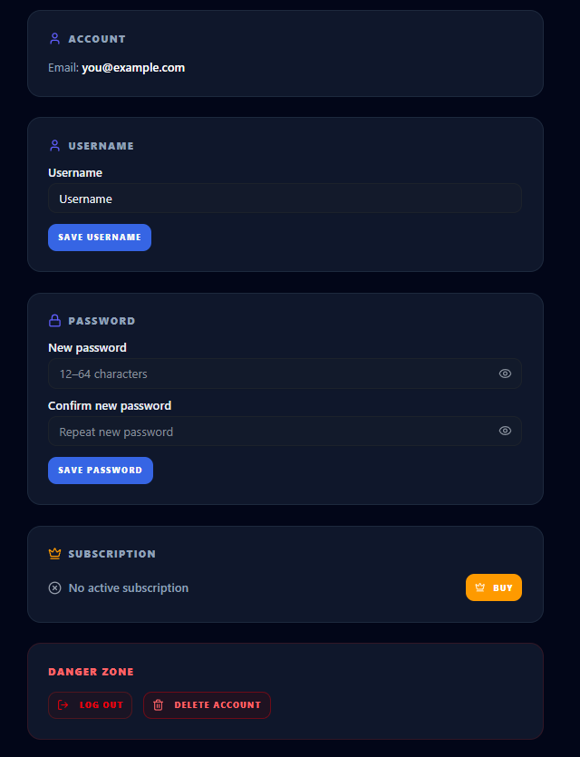
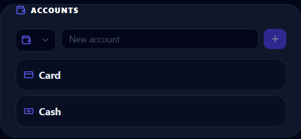
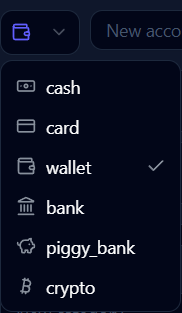
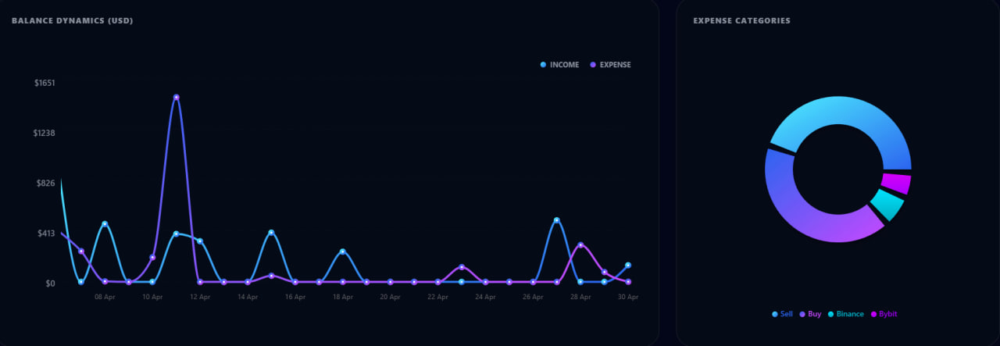
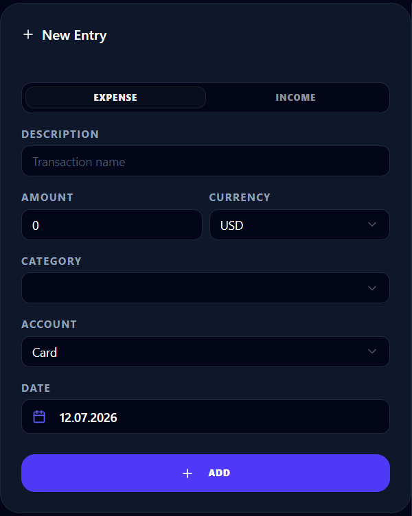
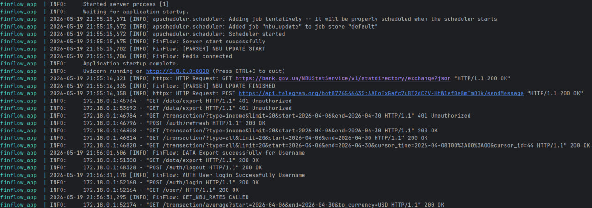
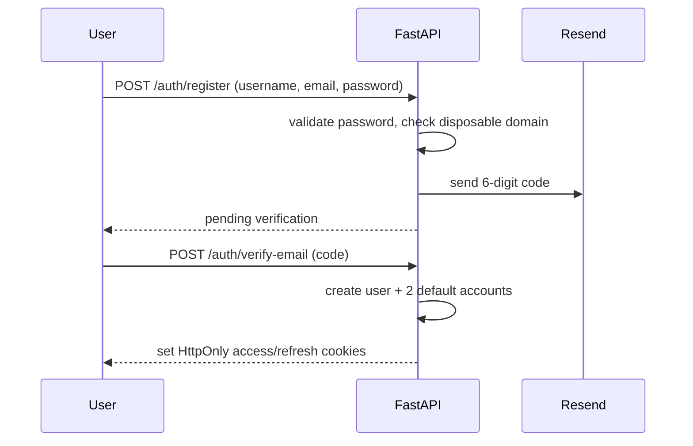

# FinFlow — Personal Finance Manager

Full-stack personal finance tracker: incomes/expenses, flexible accounts and categories, real-time multi-currency conversion with a tiered fallback strategy.

---

## Live

**[https://finflow.website](https://finflow.website)**

In production since staging completed in 2026. Health and activity are monitored continuously through a Telegram bot integration: the backend pushes event-driven alerts on errors, auth activity, and currency-source switches — not a periodic ping, but a message the moment something happens. An authorized admin can also switch the active exchange-rate source at runtime via Telegram commands, without a redeploy.

---

## Recognition

**1st place, Web Development category** — IT Student Projects Competition, Kyiv, May 2026 (Ministry of Education and Science of Ukraine, Decree No. 23/2026).

---

## Architecture



Backend, database, and cache run as isolated services in Docker Compose, with no database ports exposed to the host network. Nginx terminates TLS and reverse-proxies to the backend, stripping the `/api/` prefix and injecting `X-Real-IP` / `X-Forwarded-For`.

---

## Deployment & Infrastructure

- **Web server / reverse proxy**: Nginx serves the compiled React frontend (built with `pnpm`) and reverse-proxies API traffic to FastAPI.
- **Containerization**: Backend, PostgreSQL, and Redis run in Docker Compose on an internal bridge network — no database ports exposed to the host.
- **TLS**: Certificates via Let's Encrypt (Certbot), with enforced HTTP→HTTPS redirection.
- **Server hardening**: SSH key-only access (password auth disabled), automated brute-force protection at the host level, active log parsing.
- **Monitoring**: Prometheus scrapes metrics from the FastAPI backend and from the host via node-exporter; Grafana dashboards visualize API performance, request throughput, and host resource usage (CPU, memory, disk, network).
- **Currency rate resilience**: tiered fallback — live Redis cache → active provider (NBU/CNB) → last-known-good persistent cache → static defaults — so the conversion pipeline degrades gracefully instead of failing outright.

*Note: all architecture, backend, frontend, and DevOps work was done solely by me. See [Author](#author--contact) below.*

---

## Key Features

- **Authentication**: JWT-based system with access & refresh token rotation, Argon2 password hashing, rate limiting via SlowAPI.
- **Two-step email verification**: registration requires a 6-digit code (valid 10 minutes), delivered via the Resend API. Disposable/temporary email domains are blocked at the schema level.
- **Multi-currency**: automatic exchange rate sync with Redis caching. Primary source is the National Bank of Ukraine (NBU); on failure, falls back to the Czech National Bank (CNB) via cross-rate calculation, with a persistent last-known-good cache as final safety net. Active source switchable on demand via Telegram. View balances in USD, EUR, UAH, PLN, or CZK.
- **Accounts**: multi-account system (wallet, card, cash, savings).
  - Two default accounts created automatically on registration.
  - Free tier: limited to 2 accounts; one can be deleted (data reassigned), the other protected — at least one active account is always enforced.
  - Accounts can be renamed at any time; icon is set once at creation (icon changes post-creation not yet supported).
- **Analytics**: balance/income/expense dashboards, average daily spending/income for a given period, real-time conversion based on live rates.
- **Transactions**: cursor-based pagination for infinite scrolling, filtering by date range/category/type, smart date parsing (English/Russian input).
- **Data portability**: JSON import/export of financial history, with backend payload size validation.
- **UI**: responsive dashboard with native dark mode.
- **Telegram admin control**: real-time notifications for auth activity, errors, and currency updates, plus a command interface for runtime admin actions.

---

## UI & Application Flow

### Main Dashboard
Balance, income, and expenses converted into the user's preferred currency using live NBU rates.


### Profile


### Accounts
Every user starts with 2 default accounts; free-tier users can rename or delete one (a single active account is always required).


Available account icons at creation:




### Analytics & Visualizations


### Transaction Management


### Backend Logging
Time-zone-aware logging covering JWT rotation, payload validation, async Redis caching, and Telegram bot notifications.


*Note: all tokens, usernames, endpoints, and credentials shown above are mock data for demonstration only.*

---

## Tech Stack

**Backend**


**Frontend**


**Monitoring**


---

## Authentication Flow



1. **Sign up**: user submits username, email, password. Backend validates input (password 12–64 chars, no disposable domains) and sends a 6-digit code via Resend.
2. **Email verification**: user enters the code. On success, the account is created (with 2 default accounts) and the user is signed in via HttpOnly cookie-based tokens.

Password reset follows the same pattern: a time-limited reset link (valid 10 minutes) sent to the user's email, processed on a dedicated `/reset-password` page.

---

## Testing

```bash
pytest --cov=app --cov=core --cov=services --cov-report=term-missing
```

Current backend coverage: **73%** overall, with the highest-risk paths (auth, security, token refresh) covered at 93–100%.

```
Name                           Stmts   Miss  Cover
---------------------------------------------------
core/security.py                  49      1    98%
services/auth.py                  99      7    93%
app/endpoints/user.py             26      1    96%
core/exceptions.py                29      0   100%
services/refresh.py               22      0   100%
services/transaction.py          210     87    59%
---------------------------------------------------
TOTAL                           1029    274    73%
```

Coverage is intentionally uneven right now: authentication, security, and token handling — the parts where a bug is most costly — are covered almost completely. Transaction and account business logic are covered less thoroughly and are the current focus for additional tests.

---

## CI/CD

GitHub Actions runs on every push to `main` (or manually via `workflow_dispatch`), in two sequential jobs:

1. **`test`** — spins up a clean `ubuntu-latest` runner: checks out the repo, reconstructs `.env` from a GitHub Secret (`ENV_FILE`), starts an isolated test database via `docker-compose.test.yml`, sets up Python 3.12, installs dependencies, and runs the full `pytest` suite. Deployment is blocked if any test fails.
2. **`deploy`** (`needs: test`) — connects to the production VPS over SSH (`appleboy/ssh-action`) using secrets (`VPS_HOST`, `VPS_USER`, `VPS_SSH_KEY`), pulls the latest changes, rebuilds and restarts backend containers (`docker compose up -d --build`), and rebuilds the frontend bundle (`pnpm run build`).

---

## Security

- Rate limiting on sensitive endpoints (SlowAPI).
- Mandatory email verification via one-time 6-digit code; disposable email domains blocked (`disposable-email-domains`).
- Schema-level validation via Pydantic v2.
- Fully async I/O for concurrency.
- HttpOnly, Secure, SameSite cookie attributes for token storage.

---

## Project Structure

```text
├── .github/                    # GitHub Actions workflows (CI/CD)
├── app/                        # FastAPI application (endpoints & main)
├── assets/                     # Documentation images and screenshots
├── banks/                      # Exchange-rate providers (NBU, CNB), shared caching, fallback logic
├── core/                       # Security, JWT, dependencies, exceptions
├── database/                   # SQLAlchemy models and engine setup
├── frontend/                   # React/TypeScript source
├── grafana/                    # Grafana provisioning (dashboards, datasources)
├── limiter/                    # Rate limiting configuration
├── migrations/                 # Alembic migration history
├── prometheus/                 # Prometheus scrape configs and alert rules
├── schemes/                    # Pydantic models for validation
├── services/                   # Data access and business logic
├── telegram/                   # Async notifications/logs + long-polling admin command handler
├── tests/                      # Integration and unit test suites
├── docker-compose.yml          # Production orchestration
├── docker-compose.test.yml     # Test environment orchestration
├── Dockerfile
├── alembic.ini
├── config.py
├── logger.py
├── pytest.ini
└── requirements.txt
```

---

## Author & Contact

All architecture, backend, frontend, and DevOps work on this project was executed solely by [me](https://discord.com/users/874571768369664051). Real names are omitted for privacy reasons; feel free to reach out via Discord for official verification.

*Local deployment instructions and environment configuration are withheld for security reasons — contact the repository owner for access or inquiries.*